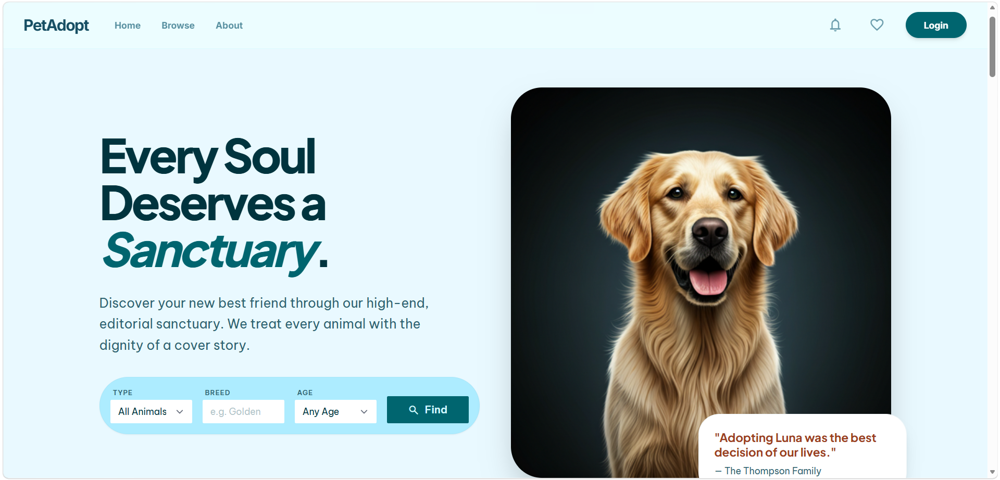

# 🐾 PetAdopt

A full-stack pet adoption platform that connects shelters with adopters. Shelters can list pets for adoption, adopters can browse, favorite, and request to adopt, and everyone gets real-time notifications along the way.

**Live demo:** [pet-adopt-pied.vercel.app](https://pet-adopt-pied.vercel.app)



---

## Features

- **Authentication & roles** — JWT-based auth with three roles: Adopter, Shelter, and Admin
- **Pet browsing** — Search and filter available pets by species, breed, age, and location
- **Adoption requests** — Adopters can submit adoption requests; shelters can review and approve/reject them
- **Favorites** — Save pets to a personal favorites list
- **Reviews** — Adopters can leave ratings and stories about their adopted pets
- **Shelter dashboard** — Shelters manage their own pet listings and incoming requests
- **Admin panel** — Admins approve new shelter/user accounts and moderate pet listings
- **Real-time notifications** — Powered by SignalR, so users see updates instantly without refreshing
- **Image uploads** — Pet photos are uploaded and served directly from the backend

## Tech Stack

**Backend**
- ASP.NET Core Web API (.NET 9)
- Entity Framework Core + Pomelo (MySQL)
- JWT Bearer Authentication
- SignalR (real-time notifications)
- Swagger / OpenAPI

**Frontend**
- React 19 + Vite
- React Router
- Axios
- Tailwind CSS
- SignalR client

**Infrastructure**
- Backend hosted on MonsterASP.NET (IIS, HTTPS via Let's Encrypt)
- Frontend hosted on Vercel
- MySQL database

## Project Structure

```
pet_adopt/
├── backend/     # ASP.NET Core Web API
└── frontend/    # React + Vite single-page app
```

Each folder is a self-contained project with its own dependencies — see below for how to run them locally.

## Getting Started

### Prerequisites
- [.NET 9 SDK](https://dotnet.microsoft.com/download)
- [Node.js](https://nodejs.org/) (v18+)
- A MySQL database

### Backend setup
```bash
cd backend
dotnet restore
```

Configure your database connection and secrets via environment variables (or `appsettings.Development.json` locally — never commit real secrets):

| Variable | Description |
|---|---|
| `ConnectionStrings__DefaultConnection` | MySQL connection string |
| `AppSettings__Token` | JWT signing secret |
| `AppSettings__Issuer` | JWT issuer |
| `AppSettings__Audience` | JWT audience |
| `Encryption__AesKey` | Key used for field-level encryption |

Then run:
```bash
dotnet run
```
The API will be available at `https://localhost:5251` (or similar — check the console output), with Swagger docs at `/swagger`.

### Frontend setup
```bash
cd frontend
npm install
```

Create a `.env.local` file with:
```
VITE_API_URL=https://localhost:5251
```

Then run:
```bash
npm run dev
```

## API Overview

The backend exposes REST endpoints for pets, adoption requests, favorites, reviews, notifications, and user/admin management, plus a SignalR hub at `/hubs/notifications` for real-time updates. Full interactive documentation is available via Swagger UI when running the backend locally, or at [`/swagger`](https://pet-adopt.runasp.net/swagger) on the live API.

